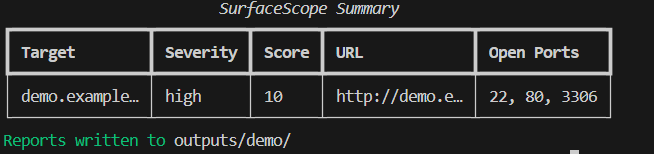
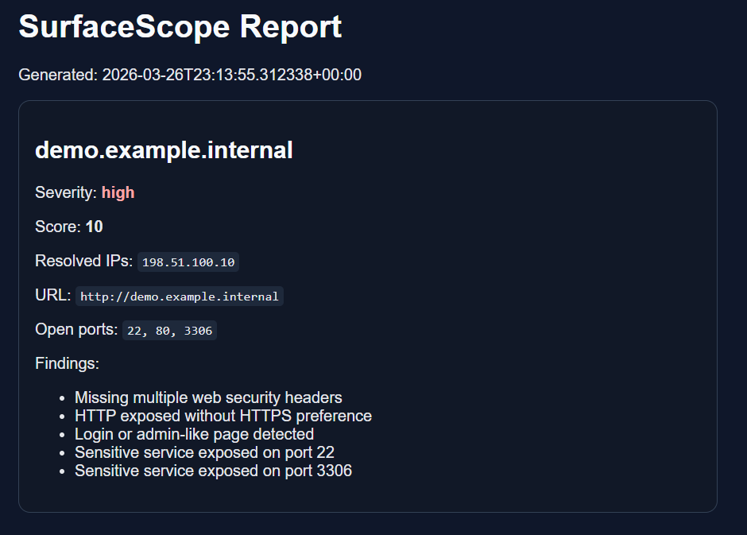

# SurfaceScope

**SurfaceScope** is a Python-based CLI tool for **authorized** attack-surface inventory, web fingerprinting, lightweight exposure scoring, and report generation.

I built this project alongside my university coursework and personal cybersecurity learning to develop more practical experience in Python automation, service discovery, HTTP/TLS analysis, and security reporting. It is designed for lab environments, internal asset discovery, defensive security workflows, and hands-on technical learning.

SurfaceScope does **not** include exploitation, payloads, or attack chaining. Its purpose is to help identify what an internet-facing asset is exposing, enrich the findings with useful technical context, and generate structured outputs for triage and documentation.

---

## Why I built this

I built SurfaceScope as part of my broader hands-on development in cybersecurity alongside my university modules and other technical projects.

I wanted to create something practical that combines:

- Python development
- CLI design
- attack surface discovery
- HTTP and TLS inspection
- basic exposure prioritization
- structured reporting

Instead of building a single-purpose script, I wanted to work on a tool that reflects a more realistic security workflow: collect, inspect, enrich, score, and report.

---

## What I worked on in this project

Through SurfaceScope, I worked on:

- building a modular Python CLI application
- handling DNS, HTTP, and TLS data
- automating external asset inspection workflows
- turning raw findings into structured reports
- designing reusable security tooling
- writing tests for core logic
- presenting technical results clearly

---

## Key features

SurfaceScope includes:

- DNS enrichment (`A`, `AAAA`, `CNAME`, `MX`, `NS`, `TXT`)
- optional certificate-transparency subdomain discovery
- HTTP fingerprinting with redirect tracking and favicon hashing
- TLS certificate inspection and certificate expiry checks
- lightweight TCP port scanning for common ports
- transparent rules-based exposure scoring
- JSON, CSV, Markdown, and HTML reporting
- resume mode to skip completed stages
- **offline demo mode** for safe end-to-end testing
- unit tests for scoring and parsing helpers

---

## Screenshots

### Demo CLI output



### Generated HTML report



---

## Why this project stands out

Compared with a basic recon or scanning script, SurfaceScope is designed as a more complete workflow.

It does not just collect raw data. It:

1. identifies externally visible services
2. enriches findings with DNS, HTTP, and TLS context
3. applies basic exposure scoring
4. exports results in multiple useful formats

This makes it more useful for defensive triage, reporting, and practical technical learning than a simple one-stage scanner.

---

## Core workflow

1. Collect inventory targets
2. Enrich DNS data
3. Probe HTTP/HTTPS services
4. Inspect TLS certificates
5. Optionally scan common TCP ports
6. Score exposures
7. Export reports

---

## Example use cases

SurfaceScope is suitable for:

- personal lab environments
- owned domains and infrastructure
- internal asset visibility exercises
- safe demonstrations in learning or testing environments
- basic exposure review before deeper manual testing

---

## Safety

Use SurfaceScope only on systems you own or have explicit written permission to assess.

This tool is intended for defensive, educational, and authorized security workflows only.

---

## Installation

```bash
python3 -m venv .venv
source .venv/bin/activate
pip install -e .